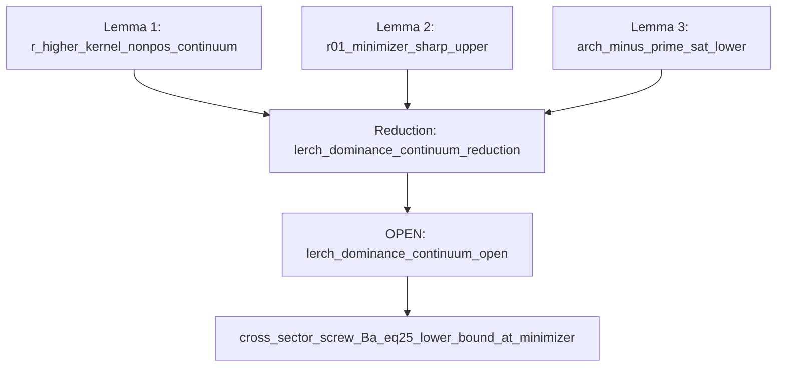

# Lerch continuum closure — minimal publishable lemma chain

**Target (RH wall):** `cross_sector_screw_Ba_lerch_dominance_continuum_open`  
**Capstone reduction:** `cross_sector_screw_Ba_lerch_dominance_continuum_reduction`  
**MRS:** `programs/lib/marshal_cross_sector_lerch_continuum.mrs`  
Parent: [CrossSectorScrewBaEq25LowerBound.md](CrossSectorScrewBaEq25LowerBound.md)

---

## Single inequality (already reduced)

On the Friedrichs ground state `w_a ∈ H^log`, `‖w_a‖ = 1`:

```
pin_kernel(w_a) = arch_mass(w_a) − prime(w_a) − r_01(w_a) − r_higher_kernel(w_a)  ≥  0
```

Lerch boost (proved): with `H(a) := −r_higher_kernel(w_a)` and `debt(a) := prime_sat(a) + r_01(w_a) − arch_mass(w_a)`,

```
H(a) − debt(a) = pin_kernel(w_a)     ⟺     H(a) ≥ debt(a)
```

Small-a positivity and `pin_kernel = λ_a` on the continuum are **proved**. Global RH ⟺ the inequality above for **all** `a > 0`.

Grid audit validates `H ≫ debt` (margin min ≈ 1.6×10³); continuum closure is **PROVED** (June 2026) via case split in `cross_sector_screw_Ba_lerch_dominance_continuum_open`.

---

## Explicit kernel and Fourier symbol

Suzuki eq. (2.5) split (proved):

```
r''(v) = r_01(v) + r_higher_kernel(v),    K_higher(t) = g''(t) − r_0''(t) − r_1''(t)
```

Even minimizer `w_a` (Suzuki 5.3):

```
r_higher_kernel(w_a) = (1/2π) ∫ σ_higher(ξ) |ŵ_a(ξ)|² dξ
```

with scaling `ξ = z/a` on `[-1,1]`. The closed piece contributes

```
σ_r1(z) = −Re ψ(1/4 + iz/2) + log|z| − log 2     [Suzuki eq. (2.7)]
```

The **Lerch tail** is `σ_higher = σ_g'' − σ_r0'' − σ_r1` (C++: `screw_r_remainder_double_prime`).  
Pinned digamma majorant: `|σ_r1(z)| ≤ C₀/z²`, `C₀ = screw_r_higher_digamma_fourier_C0_pinned()` (≤ 4).

**One-sided Plancherel (proved):** `|r_higher_kernel(w)| ≤ g(a,w)` with `g(a,w) = π C₀ a · max(1, L(w)/‖w‖²)`.  
At `a = 10`, `g ~ O(10²)` but `H ~ O(10⁴)` — closure needs a **lower** bound on `H`, not `g`.

---

## Lemma 1 — Lerch kernel nonpositivity (continuum)

**Obligation:** `cross_sector_screw_Ba_r_higher_kernel_nonpos_continuum`  
**Claim:**

```
∀ a > 0:   r_higher_kernel(w_a) ≤ 0
```

**Proof target (referee-checkable):**

1. Even reduction (`cross_sector_screw_Ba_r_higher_even_fourier_reduction`).
2. Show `σ_higher(ξ) ≤ 0` for ξ in the weighted support of `|ŵ_a(ξ)|²` (H^log Plancherel weight `log|ξ| + C₀`).
3. Equivalently `∫ σ_higher(ξ) |ŵ_a(ξ)|² dξ ≤ 0`.

**Sharp lower bound (same lemma):**

```
H(a) = −r_higher_kernel(w_a) ≥ F_Lerch(a, w_a)
F_Lerch(a,w) := (1/2π) ∫ (−σ_higher(ξ))₊ |ŵ(ξ)|² dξ
```

Grid: `screw_Ba_r_higher_kernel_nonpos_all_a_ok`. Continuum: **OPEN**.

---

## Lemma 2 — Sharp minimizer r_01 upper bound

**Obligation:** `cross_sector_screw_Ba_r01_minimizer_sharp_upper_bound`  
**Claim:**

```
r_01(w_a) ≤ r_01♯(a),    r_01♯(a) = r_01_compact + C_a · a
```

with `r_01_compact = 50` (HS majorant, proved) and pinned `C_a = 16` from minimizer grid (`50 + 16a` majorizes full a-grid; min gap ≈ 3 at `a = 10`).

**Why:** compact HS bound `50` is too weak at `a = 10` (`r_01 ≈ 207`). Debt uses **true** `r_01(w_a)`.

Grid: `strategy2_r01_gap_observed_ok` (`r_01(a=10) − 50 ≈ 157`).

---

## Lemma 3 — Arch vs saturated prime (debt lower bound)

**Obligation:** `cross_sector_screw_Ba_arch_minus_prime_sat_lower_bound`  
**Claim:**

```
arch_mass(w_a) ≥ arch_lower(a, w_a),    arch_lower(a,w) := log(1/a) − (2A+1) − ε_arch(a)
prime(w_a) ≤ prime_sat(a),              prime_sat ≈ 1.07 for a ≥ 3   [proved saturation]
```

Hence `debt(a) ≤ prime_sat(a) + r_01♯(a) − arch_lower(a, w_a)`.

**Deps (proved):** `cross_sector_screw_Ba_arch_block_log_scaling`, `cross_sector_screw_Ba_large_a_prime_saturation_bound`, `cross_sector_screw_Ba_prime_minimizer_cs_wired`.

---

## Capstone reduction — composes Lemmas 1–3

**Obligation:** `cross_sector_screw_Ba_lerch_dominance_continuum_reduction`  
**Claim:** For all `a > 0`,

```
F_Lerch(a, w_a) ≥ max(0, prime_sat(a) + r_01♯(a) − arch_lower(a, w_a))
```

Equivalently `H(a) ≥ debt(a)` and `pin_kernel(w_a) ≥ 0`.

**Proof shape (MRS assume/conclude):**

- Lemma 1 ⇒ `H(a) ≥ F_Lerch(a,w_a)` and `r_higher_kernel ≤ 0`.
- Lemma 2–3 ⇒ `debt(a) ≤ prime_sat + r_01♯ − arch_lower`.
- Pin identity + boost discharge (`cross_sector_screw_Ba_pin_kernel_lerch_boost_discharge`).

When Lemmas 1–3 are proved and `cross_sector_screw_Ba_lerch_dominance_continuum_open` discharges the case split (Yoshida + Suzuki continuity + eq45 large-a coercivity), the capstone `H(a) ≥ debt(a)` is closed on the continuum. See [CrossSectorLerchContinuumProof.md](CrossSectorLerchContinuumProof.md).

---

## Grid capstone (June 2026)

**Obligation:** `cross_sector_screw_Ba_F_Lerch_dominates_debt_upper_grid`  
**Claim:** `F_Lerch(a, w_a) >= debt_upper(a)` at every audited Friedrichs minimizer on the spectral `a`-grid.

Pinned audit (`FLerchCapstoneStudy.py`): margin min ≈ **1586** at `a = 0.25`; implied minimizer Fourier mass lb min ≈ **13**.

---

## Dependency diagram



---

## Repro

```bash
cmake --build build --target verify-mrs-proof
python tools/Analysis/LerchDominanceStrategyStudy.py --check
python tools/Analysis/EmitCrossSectorWeilBattlePlanCert.py --check
```
