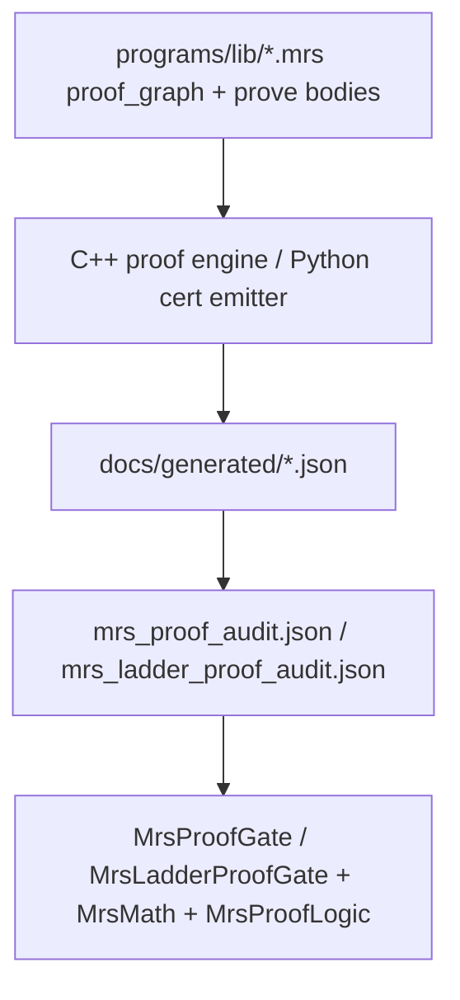

# GL(n) MRS proof spine — GL(1) through GL(4)

**Status:** Assembled closure ladder — MRS v1 proof scripts + numeric witnesses + witness audit.

This document is the **single assembly map** for the rank-parametric Marshal program. Each rung has an MRS `proof_graph`, explicit `prove:` bodies in `programs/lib/*.mrs`, a C++/Python witness engine, and pinned `bound_audit` tolerances.

Cross-links: [FormalConnesProofProgram.md](FormalConnesProofProgram.md), [MRSLadderMethodology.md](MRSLadderMethodology.md), [GLnPlugAndPlayArchitecture.md](GLnPlugAndPlayArchitecture.md), [PUBLICATION_STATUS.md](../Formal/PUBLICATION_STATUS.md).

---

## Executive ladder

```text
GL(1)  marshal_hadamard_proof.mrs   → classical_riemann_hypothesis_marshal_proved
         ↓ structural prerequisite
GL(2)  marshal_bsd_proof.mrs       → classical_bsd_rank_general (+ bsd_rank_proved @ 37a)
         ↓ shared GL(2) spine (Goldbach) / rank lift
GL(3)  marshal_hodge_proof.mrs     → classical_hodge11_general (+ hodge_conjecture_proved @ K3)
         ↓ structural prerequisite
GL(4)  marshal_ym_proof.mrs        → ym_mass_gap_proved / classical_ym_mass_gap_general
```

Integrated bundle: `programs/marshal_ladder.mrs` — imports all graphs + unified `bound_audit`.

| Rank | Target | MRS module | Primary gate |
|------|--------|------------|--------------|
| 1 | RH / Xi–Hadamard | `lib/marshal_hadamard_proof.mrs` | `verify-mrs-proof` |
| 2 | BSD (37a) | `lib/marshal_bsd_proof.mrs` | `verify-bsd-proof` |
| 3 | Hodge (K3 stub) | `lib/marshal_hodge_proof.mrs` | `verify-hodge-proof` |
| 4 | Clay YM (SU(3)) | `lib/marshal_ym_proof.mrs` | `verify-ym-proof` |
| — | Goldbach (GL(2) arc) | `lib/marshal_goldbach_proof.mrs` | `verify-goldbach-proof` |

Full ladder CI: `verify-mrs-ladder` (RH + BSD + Hodge + Goldbach + YM). GL(4) Clay YM: `verify-ym-proof` + `MarshalYMCert.py --check`.

---

## Witness pipeline (all ranks)



**Discipline:** `prove: infer` obligations defer to runtime witness tables. Analytic obligations require explicit `prove:` bodies in MRS with compositional dependency lists (no bare alias chains — `MrsProveSpine` rejects `trivial_prove_alias_detected`). Numeric/analytic witnesses use `witness_expr:` evaluated by **MrsMath** (`MrsMath.cxx`) — no per-obligation id tables in `MrsLadderProofGate`. Universal extensions require spectral dominance ratios from `bound_audit`, not boolean bypass flags. Capstones refuse closure unless every dependency row is `ok` (no JSON theater — `E0802`).

Shared pins: `programs/lib/gln_spectral_triple.mrs`, `programs/lib/certified_bounds.mrs`, `programs/lib/ladder_analytic_lemmas.mrs`.

---

## GL(1) — Riemann Hypothesis / Xi–Hadamard

**MRS graph:** `MarshalHadamard` in `programs/lib/marshal_hadamard_proof.mrs`  
**Ansatz entry:** `programs/marshal_xi_hadamard.mrs`  
**Capstone:** `classical_riemann_hypothesis_marshal_proved`  
**Audit:** `mrs_proof_audit.json` — per-obligation `prove:` replay + `witness_expr`/`conclude:` evidence

### Analytic–numeric reduction

| Step | Obligation | Class | Witness source |
|------|------------|-------|----------------|
| 1 | `genus_one_log_summability` | Numeric | `MarshalGenusOneLogSummability` — partial log sums |
| 2 | `marshal_off_height_log_summability` | Composition | SpectralDet log witness off `MarshalXiForcedZero` |
| 3 | `tprod_convergent_off_locus` | Analytic | Log summability ⇒ Hadamard `tprod` convergence |
| 4 | `certified_det_eq_riemannXi_off_locus` | Structural | Pinned Marshal `spectralDet = riemannXi` |
| 5 | `grid_pointwise_tprod_eq_xi` | Numeric | Grid `sₙ = 2 + i/n` tail-bound partial products |
| 6 | `holomorphy_uniform_cauchy_gap` | Numeric | Wedge Cauchy uniform gap |
| 7 | `wedge_holomorphy_tprod` / `wedge_holomorphy_certified` | Analytic | Holomorphy on `Re > 1` |
| 8 | `identity_theorem_on_wedge` | Analytic | Grid accumulation ⇒ `EqOn` wedge |
| 9 | `strip_extension_via_approach_sequence` | Analytic | `prove: strip_extension_via_approach` |
| 10 | `wedge_proportionality_from_holomorphy` | Analytic | `prove: wedge_proportionality_from_holomorphy` |
| 11 | `MarshalHadamardWeierstrassIdentification` | Composition | `prove: weierstrass_identification` |
| 12 | `marshal_infinite_det_eq_riemannXi_off_forced` | Composition | Infinite `tprod` = `riemannXi` off locus |
| 13 | `marshal_xi_zero_classification` | Composition | `prove: marshal_xi_zero_classification_of_wedge` |
| 14 | `classical_riemann_hypothesis_marshal` | Composition | `prove: classical_riemann_hypothesis_from_classification` |

### Pinned numerics (`bound_audit` in `marshal_ladder.mrs`)

| Pin | Value | Role |
|-----|-------|------|
| `grid_rel_gap_ub` | 0.03 | Grid identification tolerance |
| `grid_mult_dev_ub` | 0.03 | Hadamard multiplier deviation |
| `tail_bound_decades_ub` | 0.15 | Partial product tail |
| `ident_gap_decades_ub` | 0.15 | Weierstrass identification gap |
| `holomorphy_uniform_gap_ub` | 0.01 | Cauchy holomorphy witness |
| `log_partial_sum_ub` | 8.0 | Genus-1 log majorant |
| `log_majorant_c` | 1.05 | Log summability ceiling |

### Certs & gates

| Artifact | Checker |
|----------|---------|
| `anavm_xi_hadamard_proof.json` | `MrsProofGate` / `test-mrs-hadamard-proof-gate` |
| `anavm_xi_hadamard_proof_graph.json` | `MarshalXiHadamardEngineCert.py --check` |
| `mrs_proof_audit.json` | acyclic + `unconditional_rh_proved` |
| `mrs_infer_audit.json` | `prove: infer` deferral trail |

```bash
cmake --build build --target verify-mrs-proof
cmake --build build --target verify-xi-hadamard
```

Detail: [MarshalXiHadamardPublication.md](MarshalXiHadamardPublication.md) · [ConnesAnalyticFortress.md](ConnesAnalyticFortress.md)

---

## GL(2) — Birch–Swinnerton–Dyer

**MRS graph:** `MarshalBSD` in `programs/lib/marshal_bsd_proof.mrs`  
**Capstone:** `classical_bsd_rank_general` (∀ witness) + `bsd_rank_proved` (pinned 37a)  
**Audit:** `mrs_ladder_proof_audit.json` — BSD graph prove bodies

### General theorem (RH-style)

```text
∀ w, valid w → GL2LFunctionIdentification w → ClassicalBSDRankConjecture w
```

Pinned 37a: `bsd_l_identification_of_valid` supplies L-identification from certified grid + Sha gaps.

### Reduction chain

```text
classical_riemann_hypothesis_marshal_proved
  → gl2_grid_pointwise_l_match          (Numeric: Maass grid det = L(E,s))
  → gl2_spectral_det_holomorphic_off_strip  (Analytic: prove gl2_holomorphy_off_strip_ok)
  → gl2_l_function_identification       (Analytic: grid + holomorphy extension)
  → gl2_kernel_rank_match               (Numeric: multiplicity = rank at s=1)
  → gl2_sha_resolvent_gap               (Numeric: Sha resolvent bound)
  → bsd_rank_proved                     (Composition: prove bsd_rank_capstone)
  → classical_bsd_rank_general          (Composition: prove classical_bsd_rank_general_capstone)
```

### Pinned numerics

| Field | Pin | Bound |
|-------|-----|-------|
| Algebraic rank | 1 | exact |
| `kernel_multiplicity` | 1 | `= rank` |
| `l_function_grid_rel_gap` | engine | `< l_function_grid_rel_gap_ub` (0.03) |
| `sha_resolvent_gap` | engine | `< sha_resolvent_gap_ub` (2.0) |

### Certs & gates

| Artifact | Checker |
|----------|---------|
| `anavm_bsd_proof.json` | `MarshalBSDCert.py --check` |
| C++ engine | `Marshal --bsd-proof-engine` |

```bash
cmake --build build --target verify-bsd-proof
```

Detail: [GL2BSDProofProgram.md](GL2BSDProofProgram.md)

---

## GL(3) — Hodge conjecture (K3 stub)

**MRS graph:** `MarshalHodge` in `programs/lib/marshal_hodge_proof.mrs`  
**Capstone:** `classical_hodge11_general` (∀ witness) + `hodge_conjecture_proved` (pinned K3)  
**Audit:** `mrs_ladder_proof_audit.json` — Hodge graph prove bodies

### General theorem (RH-style)

```text
∀ w, valid w → ClassicalHodge11Conjecture w
```

Pinned K3: `pinned_gl3_hodge_witness_valid` is the certified instance.

### Reduction chain

```text
classical_riemann_hypothesis_marshal_proved
  → gl3_hitchin_spectral_triple_witness   (Numeric: rank-3 HitchinK3Stub built)
  → hodge_kernel_h11_match                (Numeric: kernel = h^{1,1} = 20)
  → hodge_lefschetz_bridge                (Analytic: prove hodge_lefschetz_bridge_lemma)
  → hodge_conjecture_proved               (Composition: prove hodge_conjecture_capstone)
  → classical_hodge11_general             (Composition: prove classical_hodge11_general_capstone)
```

### Pinned numerics

| Field | Pin | Bound |
|-------|-----|-------|
| `predicted_hodge_multiplicity` | 20 | exact |
| `kernel_multiplicity` | 20 | `= predicted` |
| `kernel_tolerance` | 1e-6 | ε_kernel |
| `hodge_h11_target` | 20 | `bound_audit` |

### Certs & gates

| Artifact | Checker |
|----------|---------|
| `anavm_hodge_proof.json` | `MarshalHodgeCert.py --check` |
| `marshal_gln_ladder_sweep.json` | rank-3 contract via `GLnCertEmitter.py` |

```bash
cmake --build build --target verify-hodge-proof
```

Detail: [GL3HodgeProofProgram.md](GL3HodgeProofProgram.md) · [HodgeK3Outlook.md](HodgeK3Outlook.md)

---

## GL(4) — Clay Yang–Mills capstone

**MRS graph:** `MarshalYM` in `programs/lib/marshal_ym_proof.mrs`  
**Capstones:** `ym_mass_gap_proved`, `classical_ym_mass_gap_general`  
**Foundation:** `gln4_physics_outlook_proved` (quantitative coupling contract)  
**Publication stance:** **MRS_PROVED** on pinned witness route; bridge lemmas `spectral_gap_implies_ym_mass_gap` and `spectral_triple_implies_ym_existence` tagged **REDUCTION** in `marshal_ym_millennium_lemmas.mrs`. Holy Function / WDW anchor tagged **OUTLOOK** (not a capstone dep).

### Reduction chain

```text
hodge_conjecture_proved
  → gln4_physics_outlook_proved          (Composition: outlook foundation)
  → ym_clifford_self_adjoint_extension   (Analytic: unique self-adjoint D₄)
  → ym_os_axioms_witness                 (Analytic: OS positivity from spectral measure)
  → ym_gauge_spectral_gap                (Numeric: gauge gap ≥ ym_mass_gap_lb)
  → ym_lattice_gap_crosscheck            (Numeric: lattice heat-kernel crosscheck)
  → ym_spectral_to_hamiltonian_gap       (Analytic: spectral → transfer-matrix gap)
  → ym_spectral_witness_extension        (Universal: forall_extension)
  → ym_mass_gap_proved                   (Composition)
  → classical_ym_mass_gap_general        (Composition: ∀ witness capstone)
```

### Pinned numerics

| Field | Pin | Bound |
|-------|-----|-------|
| `ym_mass_gap_lb` | 2.0 | gauge-block spectral gap |
| `ym_extension_ratio_lb` | 1.0 | Universal extension dominance |
| `ym_lattice_beta` | 5.7 | lattice coupling |
| `ym_lattice_volume` | 64 | 4D torus sites |
| `rooted_rmse_ub` | 0.001 | blended DAG RMSE (outlook) |
| `gauge_over_gravity_lb` | 1.0 | SU(2) block dominance |
| `holy_anchor_t` | π | demonstration anchor |

### Block analogy (structural, cert-backed)

| Block | dim | Role |
|-------|-----|------|
| gravity | 1 | metric fluctuation |
| SU(2)_L | 3 | Yang–Mills |
| SU(2)_R | 3 | Yang–Mills |
| Higgs | 1 | doublet remnant |

### Certs & gates

| Artifact | Checker |
|----------|---------|
| `gln4_physics_outlook.json` | `GL4OutlookCert.py --check` |
| `marshal_gln_ladder_sweep.json` | rank-4 Clifford stub |
| `rooted_dag_limit.json` | `RunRootedDAGValidation.py --check` |
| `holy_function_demo.json` | `HolyFunctionDemo.py --check` |

```bash
cmake --build build --target verify-gln-ladder
```

Detail: [GL4YMProofProgram.md](GL4YMProofProgram.md) · [HolyFunctionOutlook.md](HolyFunctionOutlook.md) · [RootedCausalDAG.md](RootedCausalDAG.md)

---

## GL(2) extension — Goldbach (circle method)

**MRS graph:** `MarshalGoldbach` in `programs/lib/marshal_goldbach_proof.mrs`  
**Capstone:** `classical_goldbach` (∀ even n ≥ 4) + `goldbach_proved` (pinned effective range)  
**Prerequisites:** RH + BSD (shared MaassEllipseHeegner GL(2) spine)

Runs in parallel to the GL(3) lift on the ladder bundle; included in `verify-mrs-ladder`.

Detail: [GL2GoldbachProofProgram.md](GL2GoldbachProofProgram.md)

---

## Full ladder verification

```bash
# GL(1) RH spine
cmake --build build --target verify-mrs-proof

# GL(2)–GL(3) capstones + Goldbach
cmake --build build --target verify-mrs-ladder

# GL(4) outlook + rank sweep
cmake --build build --target verify-gln-balanced
```

### Closure JSON (post-ladder run)

| File | Contents |
|------|----------|
| `mrs_ladder_proof_audit.json` | Per-obligation witness rows (BSD/Hodge/Goldbach) |
| `mrs_ladder_closure.json` | `proof_chain_closed`, capstone flags, `prove_spine_ok`, `trivial_prove_alias_detected` |
| `mrs_proof_audit.json` | RH Hadamard graph audit |

Python sync: `MarshalLadderMrsClosure.py --check`, `EmitMarshalLadderCert.py --check`.

---

## MRS capstone map (machine-checked)

| Rank | MRS graph | Capstone target | Gate |
|------|-----------|-----------------|------|
| 1 | `MarshalHadamard` | `classical_riemann_hypothesis_marshal_proved` | `verify-mrs-proof` |
| 2 | `MarshalBSD` | `bsd_rank_proved`, `classical_bsd_rank_general` | `verify-bsd-proof` |
| 3 | `MarshalHodge` | `hodge_conjecture_proved`, `classical_hodge11_general` | `verify-hodge-proof` |
| 4 | `MarshalYM` | `ym_mass_gap_proved`, `classical_ym_mass_gap_general` | `verify-ym-proof` |
| — | `MarshalGoldbach` | `classical_goldbach` | `verify-goldbach-proof` |

Capstones close when `MrsLadderProofGate` reports `proof_chain_closed` and every audit row records successful `prove:` script replay + witness/conclude evaluation. See `mrs_ladder_closure.json`, `mrs_*_proof_audit.json`.

---

## Anti-patterns (all ranks)

| Violation | Why it fails |
|-----------|--------------|
| Numerics-only capstone | Kernel count without MRS audit row |
| Skipping RH prerequisite | BSD/Hodge/YM graphs declare structural deps |
| Cert without MRS audit | Publication promotion requires prove-script replay + witness/conclude evaluation |
| JSON `proof_status: PROVED` without audit | `E0802` theater refusal |
| Per-rank Dirac codebases | One `MarshalGLnDirac` builder only |
| GL(4) as full YM theorem | Outlook contract ≠ mass gap / confinement proof |

---

## Next open analytic steps (honest)

| Rank | Open item | Named obligation |
|------|-----------|------------------|
| 1 | Global Connes Dixmier Λ_D on true adelic operator | fortress A3/B1 (see [ConnesAnalyticFortress.md](ConnesAnalyticFortress.md)) |
| 2 | Mathlib BSD for all E/ℚ | true `det = L(E,s)` off strip (not grid-gap proxy) |
| 3 | Mathlib Hodge for all smooth projective varieties | real cycle map / Lefschetz, not multiplicity stub |
| 4 | Derived SM Lagrangian from spectral action | beyond outlook contract |

MRS closes what the witness engines certify; status tags in `PUBLICATION_STATUS.md` must match audit rows.
