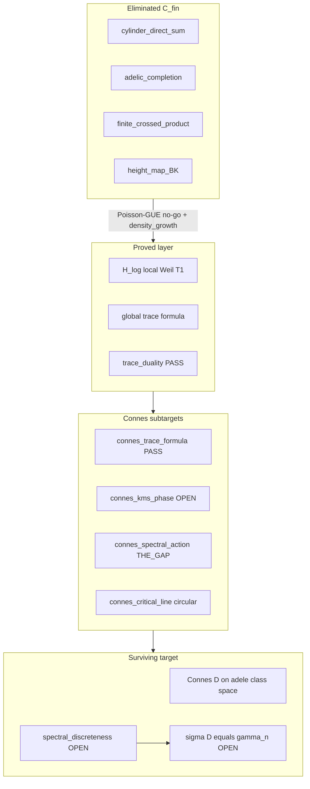

# Global operator hunt (elimination and inference)

**Goal:** Hunt down the global Hilbert–Pólya operator by permanent elimination of falsified classes and inference of required traits. Fast numerics are **sanity checks only** — not finite spectrum identification.

Cross-links: [PoissonGueNoGo.md](PoissonGueNoGo.md), [ExplicitFormulaDuality.md](ExplicitFormulaDuality.md), [AnalyticConnesProgram.md](AnalyticConnesProgram.md), [TestGateDiscipline.md](TestGateDiscipline.md), [OperatorTraitRegistry.json](OperatorTraitRegistry.json).

---

## Epistemic discipline

> The hunt succeeds not when Connes is proved, but when every other path is permanently excluded and the remaining open problems are precisely catalogued. `OPERATOR_HUNT_SANITY_PASS` means "we are not fooling ourselves today." It does not mean "RH is close."

---

## Elimination funnel



---

## Trait profile

| Category | Traits | Status |
|----------|--------|--------|
| **Hard excludes** | `in_C_fin`, `direct_sum_merge`, `finite_rank_coupling`, `smooth_height_renorm`, `poisson_bulk` | FALSIFIED / PROVED |
| **Hard requires** | `self_adjoint`, `discrete_on_strip`, `gamma_free`, `gue_level_repulsion`, `twisted_trace_p_weights`, **`density_growth: logarithmic`** | inferred |
| **Proved** | `trace_duality`, `local_weil_t1`, `global_weil_trace` | certs |
| **Target** | `connes_dirac_global` — see CONNES_SUBTARGETS | mixed |

### Dualistic architecture

| Operator | Spectrum | Trace role |
|----------|----------|------------|
| $H_\gamma$ (target) | $\{\gamma_n\}$ | $\mathrm{Tr}(h(H_\gamma))$ |
| $H_{\log}$ (local factor) | $\{k\log p\}$ | $\mathrm{Tr}_{w'}(h(H_{\log}))$ |
| Global $D$ (Connes) | must be discrete on strip | $\mathrm{Tr}(h(D))=\sum h(\gamma_n)$ via Weil |

Trace duality links $H_\gamma$ and $H_{\log}$ through arch + poles — **not** spectral equality. See [ExplicitFormulaDuality.md](ExplicitFormulaDuality.md).

---

## Density-scaling trait (irreversible)

Riemann zero density: $dN/d\gamma \sim (1/2\pi)\log(\gamma/2\pi)$ — **logarithmic growth**.

| Candidate | `density_growth` | Verdict |
|-----------|------------------|---------|
| Cylinder direct sum | `constant` | **FAIL** — [CylinderNoGo.md](CylinderNoGo.md) Thm 2 |
| BK / height map | `inverse_logarithmic` | **FAIL** — smooth renormalization cannot fix slope |
| Connes $D$ | `emergent_from_quotient` | **OPEN** — analytic only |

Even if BK RMSE dips locally at some $P$, the density trait **permanently blocks** re-introduction. This is structural, not parameter tuning.

---

## CONNES_SUBTARGETS

`connes_dirac_global` is a **hypothesis container**, not a proof. Score only testable subtargets.

| Subtarget ID | Trait | Marshal-verifiable? | Status |
|--------------|-------|---------------------|--------|
| `connes_algebra_type` | `noncommutative_crossed_product` | No (definition) | Scaffold |
| `connes_trace_formula` | `trace_duality` | **Yes** (T1 + Gauss) | **PASS** |
| `connes_kms_phase` | `phase_transition_at_beta_1` | Partially | OPEN |
| `connes_spectral_action` | `discrete_spectrum_selected` | **No at finite P** | **THE GAP** |
| `connes_bk_height_map` | `log_n_height_renormalization` | **Yes** | **FALSIFIED** |
| `connes_self_adjoint_extension` | `extension_from_spectral_action` | Partially | OPEN |
| `connes_critical_line` | `spectrum_on_Re_half` | No (uses RH) | Circular — excluded from scoring |

**Honest count:** 2 of 7 scored subtargets are Marshal-closed today (trace PASS, height map FALSIFIED). Spectral action remains THE GAP.

---

## Fast sanity suite

```bash
python tools/Workload/RunOperatorHuntSanity.py --quick   # <60s
python tools/Workload/RunOperatorHuntSanity.py --full    # + continuum persistence
```

Export: `docs/generated/operator_hunt_sanity.json`

See [TestGateDiscipline.md](TestGateDiscipline.md) for gate classes and analytic shape verdicts.

---

## Analytic proof track (post-hunt)

1. **`spectral_discreteness`** — THE GAP (`connes_spectral_action`)
2. **`self_adjoint_extension_selection`** — spectral action, not height map
3. **`spectral_det_xi`**
4. **`sigma_D_equals_gamma`**

`ANALYTIC_SHAPE_BAD` on continuum persistence **can** falsify the current scaffold; finite numerics cannot prove these lemmas.

---

## END STATE (operator hunt closed)

**Verdict:** `OPERATOR_HUNT_CLOSED` — certificate `docs/generated/operator_hunt_closure.json`

The hunt **succeeds** when every other path is permanently excluded and remaining open problems are precisely catalogued. RH is **not** claimed.

| Phase | Status | Certificate |
|-------|--------|-------------|
| 𝒞_fin elimination | **CLOSED** | `operator_hunt_sanity.json`, PoissonGueNoGo |
| Trait profile | **LOCKED** | `operator_candidates.json`, OperatorTraitRegistry |
| Scaffold v2 | **DONE** | no BK `height_map`; `OPEN_SPECTRAL_DISCRETENESS` |
| Continuum ladder | **CLASSIFIED** | `continuum_persistence.json` → `ANALYTIC_SHAPE_BAD` |
| **Surviving target** | `connes_analytic_construction` | TARGET |
| **THE GAP** | `spectral_discreteness` | analytic proof only |

### Remaining proof track (post-closure)

1. `self_adjoint_extension_selection` — spectral action, not height map  
2. **`spectral_discreteness`** — discrete spectrum on critical strip  
3. `spectral_det_xi` — determinant identification  

Regenerate closure + `next_actions.json`:

```bash
python tools/Workload/RunOperatorHuntClosure.py
```
