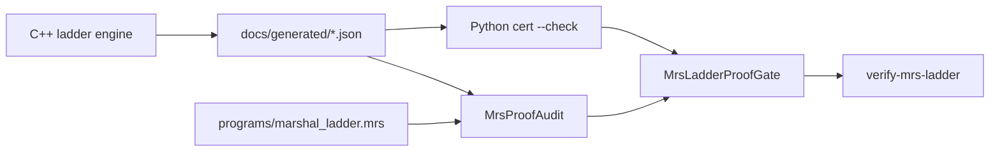

# MRS Ladder Methodology — BSD, Hodge, Goldbach (v1-extended)

**Prerequisite:** Classical RH closed via `marshal_hadamard_proof.mrs` — see [PUBLICATION_STATUS.md](../Formal/PUBLICATION_STATUS.md).

Cross-links: [GLnPlugAndPlayArchitecture.md](GLnPlugAndPlayArchitecture.md), [GrandUnificationManifesto.md](GrandUnificationManifesto.md), [MrsLanguage.md](../AnaVM/MrsLanguage.md).

---

## Epistemic tiers

| Tier | Tag | Meaning | CI gate |
|------|-----|---------|---------|
| Full closure | `PROVED` | All MRS obligations `PROVED`; capstone theorem in Lean | `verify-*-proof` + `MrsLadderProofGate` |
| Numeric witness | `NUMERIC_WITNESS` | Pinned bounds satisfied; analytic lemma pending | bounds check only |
| Evidence | `EVIDENCE` | Kernel multiplicity / rank match demo | cert `--check` (legacy) |
| Open | `ANALYTIC_OPEN` | Named obligation without witness | gate refuses |

**Rule:** Capstones (`bsd_rank_proved`, `hodge_conjecture_proved`, `goldbach_proved`) require tier `PROVED` on every dependency. No JSON theater flags (E0802).

---

## Witness pipeline



1. **MRS `bound_audit`** — authoritative pinned tolerances in `programs/marshal_ladder.mrs`
2. **C++ engine** — measured `max_*` fields in proof JSON
3. **`mrs_proof_audit.json`** — per-obligation witness rows
4. **Python cert `--check`** — drift + capstone obligation presence
5. **Lean** (optional) — exact rationals from cert JSON via `norm_num`

---

## Error-bound contract

Every obligation documents `(measured_field, upper_bound, tolerance_source)`:

| Conjecture | Primary gates | Pinned values |
|------------|---------------|---------------|
| BSD (GL(2)) | kernel rank match, L-grid gap, Sha resolvent gap | rank=1 @ 37a; grid gap ≤ 0.03; sha_gap ≤ 1.0 |
| Hodge (GL(3)) | h^{1,1} kernel match | multiplicity = 20; ε_kernel = 1e-6 |
| Goldbach (GL(2)) | major arc ≥ τ; minor arc ≤ ub | τ = 0.45; minor_arc_ub = 0.01 |

RH prerequisite: all ladder graphs declare `deps: [bsd_rh_prerequisite]` referencing `classical_riemann_hypothesis_marshal_proved`.

---

## MRS module layout

| Path | Role |
|------|------|
| `programs/marshal_ladder.mrs` | Entry ansatz + `bound_audit` |
| `programs/lib/gln_spectral_triple.mrs` | Shared rank 2–3 spectral triple pins |
| `programs/lib/marshal_bsd_proof.mrs` | BSD proof graph |
| `programs/lib/marshal_hodge_proof.mrs` | Hodge proof graph |
| `programs/lib/marshal_goldbach_proof.mrs` | Goldbach proof graph |

---

## Anti-patterns

| Violation | Example |
|-----------|---------|
| Numerics-only closure | `proof_status: PROVED` from kernel count alone |
| Per-rank codebases | Separate `MarshalGL2Dirac` / `MarshalGL3Dirac` |
| Skipping RH gate | Ladder work without `bsd_rh_prerequisite` edge |
| Drift without pin | Changing bounds without updating MRS + cert + C++ |
| Capstone theater | `bsd_rank_proved: true` in JSON without audit row |

See [Discipline.md](Discipline.md) for global forbidden patterns.

---

## CI targets

```bash
cmake --build build --target verify-gln-ladder
cmake --build build --target verify-bsd-proof
cmake --build build --target verify-hodge-proof
cmake --build build --target verify-goldbach-proof
cmake --build build --target verify-mrs-ladder   # RH + all ladder gates
```
