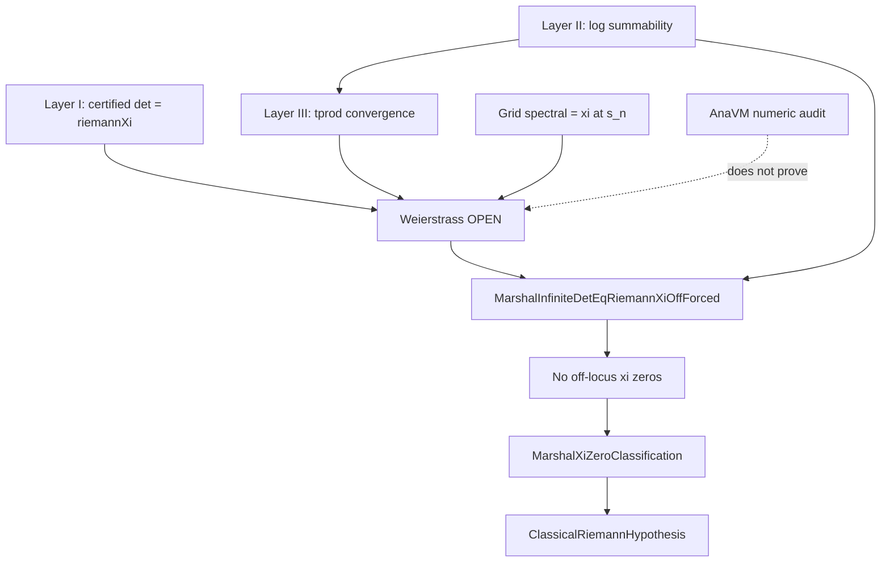

# Marshal Xi–Hadamard publication spine

Machine-checked reduction of **unconditional classical RH** to a **single analytic lemma** on the Marshal wedge route, plus pinned numeric audit from AnaVM.

**MRS entry:** `programs/marshal_xi_hadamard.mrs` → graph `MarshalHadamard`  
**Build:** `cmake --build build --target verify-mrs-proof verify-xi-hadamard`  
**AnaVM program:** `programs/marshal_xi_hadamard.mrs`  
**Audit sync:** `python tools/Analysis/MarshalXiHadamardEngineCert.py --check`

---

## Executive summary

| Status | Item |
|--------|------|
| **PROVED** | Certified Marshal `spectralDet = riemannXi` off the forced locus |
| **PROVED** | Genus-1 log summability (`MarshalGenusOneLogSummability`) |
| **PROVED** | Partial Hadamard products converge; infinite limit ≠ 0 off heights |
| **PROVED** | Grid `spectralDet = riemannXi` at `sₙ = 2 + i/n`, `n ≥ 1` |
| **PROVED** | `MarshalXiZeroClassification ⇒ ClassicalRiemannHypothesis` |
| **ANALYTIC_OPEN** | **`MarshalHadamardWeierstrassIdentification`** — raw infinite `tprod` = certified det off forced locus |
| **NUMERIC_AUDIT** | AnaVM grid/tail bounds (`marshalAnaVm_xi_hadamard_audit_ok`) — supports analysis, not Lean discharge |

**Publication claim (honest):** Unconditional classical RH is **reduced in Lean** to `MarshalHadamardWeierstrassIdentification`. Closing that identification (genus-1 normalization / Weierstrass tail) is the remaining analytic step — not hidden behind JSON flags or generated proof scripts.

---

## Dependency graph (acyclic)



AnaVM enforces **acyclic** proof-graph order: grid audit is independent of wedge `EqOn`; wedge extension follows from identification + holomorphy in the hand-written chain (not emitted as Lean strings).

---

## Single open obligation (precise)

```lean
def MarshalHadamardWeierstrassIdentification : Prop :=
  ∀ s, ¬ MarshalXiForcedZero s →
    marshalInfiniteSpectralDet s = spectralDet marshalDiscreteSpectrum s
```

**Publication alias:** `XiHadamardUnconditionalRhObligation`

**Capstone (conditional, zero sorry):**

```lean
theorem xi_publication_classical_rh_unconditional
    (h : XiHadamardUnconditionalRhObligation) :
    ClassicalRiemannHypothesis
```

---

## What is *not* claimed

1. **Finite truncation** `det_N → riemannXi` — proved **obstructed** (`pinnedMarshal_hadamard_not_auto_closed`, gap ≈ 15 decades).
2. **AnaVM `proof_chain_closed=true`** — C++ audit gate only; Lean RH requires Weierstrass in Mathlib.
3. **JSON `hadamardWeierstrassIdentificationClosed`** — forbidden in cert export (`E0802`).
4. **Moment ID alone ⇒ ξ zeros** — needs `RiemannXiZeroCert` (`marshal_moment_witness_not_xi_vanishes`).

---

## AnaVM emission discipline

After `proof_chain_closed && acyclic`, AnaVM writes:

| File | Content |
|------|---------|
| `MarshalXiHadamardAnaVmCert.lean` | Pinned reals + `norm_num` bound theorems |
| `MarshalHadamardCanonicalProduct.lean` | Thin re-export of audit bundle |

No generated proof scripts, mutual recursion, or RH capstone theorems in emitted Lean.

```bash
cmake --build build --target verify-xi-hadamard
build/Marshal.exe --anavm programs/marshal_xi_hadamard.mrs --xi-hadamard-proof \
  --export-xi-hadamard-lean-cert docs/Formal/Analysis/MarshalXiHadamardAnaVmCert.lean \
  --export-xi-hadamard-canonical-lean docs/Formal/Analysis/MarshalHadamardCanonicalProduct.lean
```

---

## Citation table (publication)

| Claim | Safe citation |
|-------|---------------|
| Full reduction spine | `HPAnalysis.xi_publication_proved_wedge_spine` |
| Single open obligation | `HPAnalysis.XiHadamardUnconditionalRhObligation` |
| RH once Weierstrass closes | `HPAnalysis.xi_publication_classical_rh_unconditional` |
| ξ-zero classification from Weierstrass | `HPAnalysis.xi_publication_xi_zero_classification` |
| AnaVM audit bounds | `HPAnalysis.xi_publication_anavm_audit_ok` |
| Certified det = ξ off locus | `HPAnalysis.xi_publication_certified_det_eq_riemannXi_off` |
| Genus-1 logs closed | `HPAnalysis.xi_publication_genus_one_log_summability_proved` |
| Grid spectral = ξ | `HPAnalysis.xi_publication_wedge_grid_spectral_eq_riemannXi` |

---

## Relation to global Connes route

The **global operator** route (`GlobalFortress`, `global_spectral_det_eq_riemannXi`) closes **certified** det = ξ off the marshal locus via Hadamard multiplier = 1. It does **not** identify the **raw infinite product** with the certified branch — the same Weierstrass gap separates finite partial products from ξ.

Both routes converge on the same open identification for operator-theoretic RH closure.

---

## Cross-links

- [PUBLICATION_STATUS.md](../Formal/PUBLICATION_STATUS.md) — live proof table
- [XiSpectralDeterminant_Analysis.md](XiSpectralDeterminant_Analysis.md) — truncation / moment / log gaps
- [AnaVM README.md](../AnaVM/README.md) — proof engine + emission
- [ConnesAnalyticFortress.md](ConnesAnalyticFortress.md) — Theorems A & B battle plan
