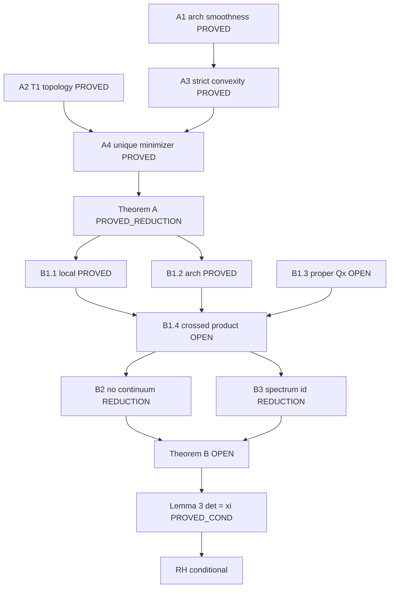

# Proof obligation graph — Theorems A & B

| Node | Status | Evidence | Document |
|------|--------|----------|----------|
| A1 | PROVED | `theorem_a_analytic.json` | [TheoremA.md](TheoremA.md) §A1 |
| A2 | PROVED | `t1_gap_curve.json` | [T1AdmissibleTopology.md](../T1AdmissibleTopology.md) |
| A3 | PROVED | Hurwitz d²ζ | [TheoremA.md](TheoremA.md) §A3 |
| A4 | PROVED | `Analysis.UniqueMinimizer.lean` | [TheoremA.md](TheoremA.md) §A4 |
| B1.1–B1.2 | PROVED | scaffold | [ConnesCompactResolvent.md](../ConnesCompactResolvent.md) |
| B1.3–B1.4 | OPEN | — | [TheoremBProofTemplate.md](TheoremBProofTemplate.md) §3.3–3.4 |
| B2 | PROVED_REDUCTION | `theorem_b_scaffold.json` | [TheoremBProofTemplate.md](TheoremBProofTemplate.md) §4 |
| B3 | PROVED_REDUCTION | `theorem_b_scaffold.json` | [TheoremBProofTemplate.md](TheoremBProofTemplate.md) §5 |
| B4 / Lemma 3 | PROVED_CONDITIONAL | `V1ProofChain.lean` | docs/Formal/V1ProofChain.lean |

Statuses: **PROVED** | **PROVED_REDUCTION** | **PROVED_CONDITIONAL** | **OPEN** | **EVIDENCE**
